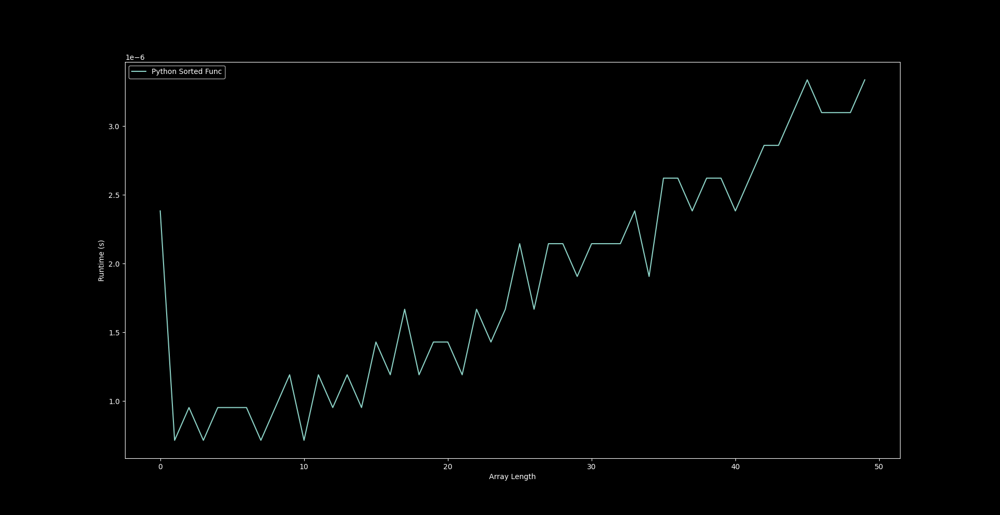

# ProfPlot

This python module contains classes that facilitate the profiling of classes
and functions and the generation of plots from such data.

## Example Usage
You can refer to the fibonaci profiling script, the test directory or the
following example.

Say we want to profile python's "sorted" function.
~~~
from random import randint
import matplotlib.pyplot as plt
import profplot

# Create plotter object
x_axis_label = "Array Length"
y_axis_label = "Runtime (s)"
plotter = profplot.ProfilePlotter(x_axis_label, y_axis_label)

# add profile to plotter.
# copy the names of the variables from the function. Since we want to vary the
# 'iterable' parameter we give to the sorted function, we make the value for
# this key an iterable of the object type we wish to give to the function. Since
# sorted takes iterables, we set the value under this key to be an iterable of
# lists. Then set var_key to 'iterable'.
kwargs = {'iterable': [[randint(0, 100) for j in range(i)] for i in range(50)]}

var_key = 'iterable'

# function to apply to each element in the var_key iterable.
# This is used as the x axis value.
def var_conv_func(x): return len(x)

# we wrap the sorted function here because passing 'iterable' as a kwarg to
# sorted # doesn't work.
def func(iterable): return sorted(iterable)

plotter.set_func_profile("Python Sorted Func", func, kwargs, var_key,
                         var_conv_func)
plt.style.use("dark_background")
fig, ax = plotter.plot()
fig.show()
input()
~~~

## Sample output

